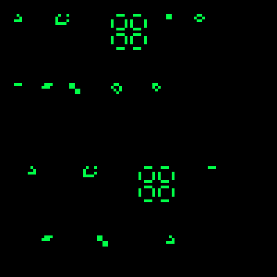

# Conway's Game of Life



## Reglas

1. Célula viva con menos de 2 vecinos vivos → muere (subpoblación).
2. Célula viva con 2 o 3 vecinos vivos → sobrevive.
3. Célula viva con más de 3 vecinos vivos → muere (sobrepoblación).
4. Célula muerta con exactamente 3 vecinos vivos → nace (reproducción).

## Cómo ejecutar

```bash
cargo run
```
